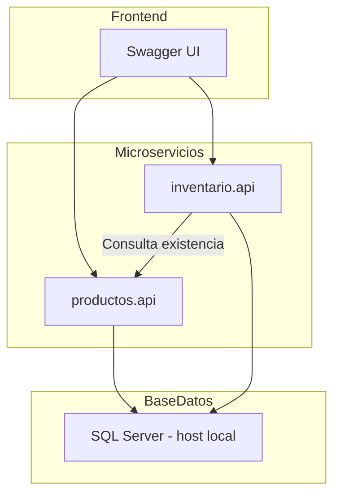

# 🛠️ Prueba Técnica Backend – Microservicios .NET Framework

Este proyecto implementa una solución compuesta por dos microservicios:

- productos.api
- inventario.api

Ambos están desarrollados en ASP.NET Web API (.NET Framework 4.6.1), dockerizados y comunicados entre sí.  
Incluye validaciones, autenticación por API key, logging, pruebas unitarias, health checks, documentación Swagger y conexión a SQL Server desde el contenedor.

---

## Tecnologías utilizadas

- ASP.NET Web API (.NET Framework 4.6.1)
- Visual Studio 2017
- Docker + Docker Compose (Windows Containers)
- SQL Server (local)
- Swashbuckle (Swagger)
- MSTest + Moq (pruebas unitarias)
- Mermaid (diagramas en README)
- PowerShell (configuración de entorno)

---

## Arquitectura del sistema



## Scripts SQL – Creación de la base de datos y tablas

Puedes ejecutar los siguientes scripts directamente desde SQL Server Management Studio (SSMS).

### Crear base de datos y tablas

```sql
CREATE DATABASE PruebaTecnicaDb;
GO
USE PruebaTecnicaDb;

-- Tabla de productos
CREATE TABLE Productos (
    Id INT IDENTITY(1,1) PRIMARY KEY,
    Nombre NVARCHAR(100) NOT NULL,
    Precio INT NOT NULL,
    Descripcion NVARCHAR(MAX) NULL
);

-- Tabla de inventario con clave foránea
CREATE TABLE Inventario (
    ProductoId INT PRIMARY KEY,
    Cantidad INT NOT NULL,
    FOREIGN KEY (ProductoId) REFERENCES Productos(Id)
);
```


## Conexión con SQL Server local desde Docker

Los microservicios se conectan a SQL Server instalado en tu equipo (host Windows) usando el nombre especial:  
host.docker.internal

Para que esto funcione correctamente, es necesario configurar lo siguiente:

### 1. Fijar el puerto 1433 en SQL Server

1. Abrir SQL Server Configuration Manager
2. Ir a Protocols for SQLEXPRESS → TCP/IP → doble clic
3. En la pestaña IPAll:
   - TCP Dynamic Ports → (dejar vacío)
   - TCP Port → 1433
4. Reiniciar el servicio de SQL Server

### 2. Crear usuario de autenticación SQL

Desde SSMS, ejecutar:

```sql
CREATE LOGIN dockerUser WITH PASSWORD = '12345!';
USE PruebaTecnicaDb;
CREATE USER dockerUser FOR LOGIN dockerUser;
ALTER ROLE db_owner ADD MEMBER dockerUser;
```
Asegúrate de que la autenticación mixta esté habilitada.

### 3. Permitir conexiones entrantes por el puerto 1433 (Firewall)
Ejecutar en PowerShell (como administrador):
```
New-NetFirewallRule -DisplayName "SQL Server 1433 para Docker" `
  -Direction Inbound -Protocol TCP -LocalPort 1433 `
  -Action Allow
```

##  Ejecución con Docker Compose
Asegúrate de haber publicado ambos proyectos (productos.api e inventario.api) con Visual Studio en sus respectivas carpetas, y tener un archivo docker-compose.yml en la raíz.

```
Productos/
    docker-compose.yml
    Productos/
        Dockerfile
        (archivos publicados del proyecto productos.api)
    Inventario/
        Dockerfile
        (archivos publicados del proyecto inventario.api)
```
## Comandos para iniciar/crear los contenedores
Se debe ubicar desde cmd en la carpeta raiz del proyecto donde esta el archivo docker-compose.yml
- docker-compose build
- docker-compose up -d

## Autenticación
Todos los endpoints protegidos requieren el siguiente encabezado en las solicitudes HTTP: `x-api-key: conectionTest`
Este valor es verificado en los middleware de ambos microservicios.

## Documentación Swagger

Cada microservicio expone su documentación Swagger de forma automática cuando los contenedores están en ejecución:

- productos.api → http://localhost:8080/swagger
- inventario.api → http://localhost:8081/swagger

Desde Swagger puedes consultar y probar directamente los endpoints REST de cada servicio.


## Endpoints disponibles

### productos.api

| Metodo | Ruta                      | Descripción                                             |
|--------|---------------------------|---------------------------------------------------------|
| GET    | /api/productos            | Retorna el listado completo de productos               |
| GET    | /api/productos/{id}       | Retorna un producto por su ID                          |
| POST   | /api/productos            | Crea un nuevo producto. Requiere nombre, precio, stock |
| GET    | /api/health /productos    | Verifica si el microservicio productos está disponible |


### inventario.api

| Método | Ruta                              | Descripción                                                              |
|--------|-----------------------------------|--------------------------------------------------------------------------|
| POST   | /api/inventario                   | Crea un nuevo registro de inventario asociado a un producto             |
| POST   | /api/inventario/comprar           | Realiza la compra de un producto si hay inventario suficiente           |
| GET    | /api/inventario/{productoId}      | Verifica si existe inventario para el ID de producto especificado       |
| GET    | /api/health/inventario            | Endpoint de verificación del estado del servicio (health check)         |


##  Pruebas unitarias
Ambos microservicios cuentan con pruebas unitarias en proyectos separados:

- productos.tests
- inventario.tests

Las pruebas están enfocadas en la lógica de los controladores y no requieren conexión a base de datos.

### Cómo ejecutar las pruebas unitarias

1. Abrir la solución en Visual Studio
2. Ir a Test > Test Explorer
3. Clic en "Run All"

## Health Check
Cada microservicio expone un endpoint para ver su estado, este endpoint retorna un objeto simple con información de disponibilidad:

```json
{
  "status": "ok",
  "service": "Productos Service"
  "timestamp": "2025-07-03T19:43:00Z"
}
```


